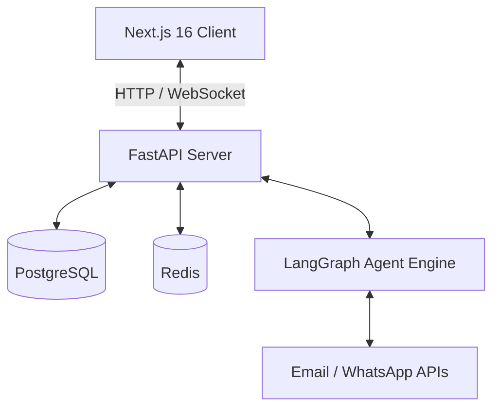

# VisionNode (SheetAgent) Architecture

**VisionNode** (also known as SheetAgent) is built as a highly responsive, agentic spreadsheet platform designed to manage and automate workflows for event organizers. 

The application is structured as a **Monorepo** comprising a Next.js 16 frontend and a FastAPI backend, enabling real-time row synchronization, AI agent automation, and large scale data processing.

## 🏗️ High-Level Architecture

### 1. Frontend (Next.js 16, React 19)
- **Framework & Routing:** App Router (Turbopack) for server-side rendering and quick navigation.
- **Styling:** Tailwind CSS v4 using a HexaCore cyber-industrial dark aesthetic (`#0B0B0B` background, glassmorphism).
- **State & Data Fetching:** TanStack Query for robust caching, combined with custom WebSocket hooks (`useSheetSocket`) for real-time spreadsheet updates.
- **Spreadsheet Engine:** TanStack Table (headless) for performance, rendering a `DataGrid` with editable cells, row selection, and sticky headers.
- **Demo Mode:** The frontend gracefully falls back to mock `Demo Data` when the backend is disconnected, ensuring it remains fully representable as a standalone UI prototype for hackathon presentations.

### 2. Backend (FastAPI, Python 3.12)
- **API Architecture:** RESTful API (`/api/v1`) using a thin-router, fat-service pattern for clear separation of concerns.
- **Real-Time Layer:** Native in-memory WebSocket manager (`/ws/sheet/{id}`) that broadcasts row updates `row_created`, `row_updated`, `row_deleted` to all active clients.
- **Database (PostgreSQL + asyncpg):** Uses SQLAlchemy async models (Workspace, Sheet, Row, AgentRule, AgentLog). 
  - Uses **JSONB** for dynamic row schemas (highly flexible grid).
  - Uses **Fractional Indexing** for efficient row ordering.

### 3. Agent Orchestration Engine (Planned)
- **LangGraph & Celery:** A rule engine evaluates incoming cell changes. If an agent trigger matches (e.g., "Status = Shortlisted"), an automation task is enqueued in Redis and executed by Celery workers via LangGraph.
- **Automations:** WhatsApp messaging (Selenium/Meta API), Email (Resend/smtplib), group creation, and AI data cleaning.

### 4. Deployment & DevOps
- **Local Dev:** Docker Compose running PostgreSQL, Redis, FastAPI, and Next.js in parallel.
- **CI/CD:** GitHub Actions running formatting & types checks securely (`eslint`, `tsc`, `ruff`).
